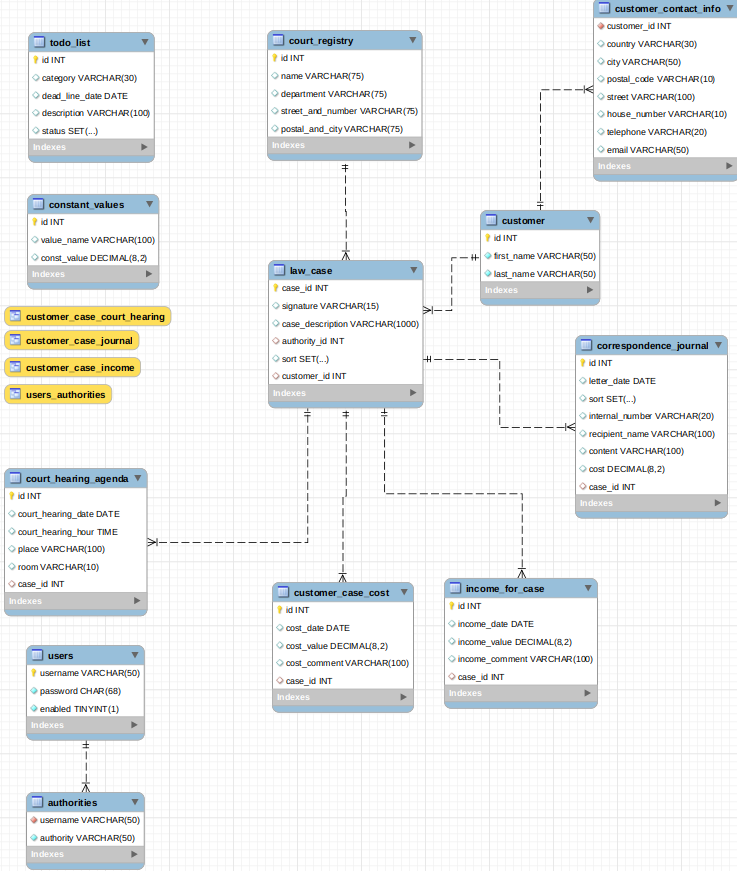
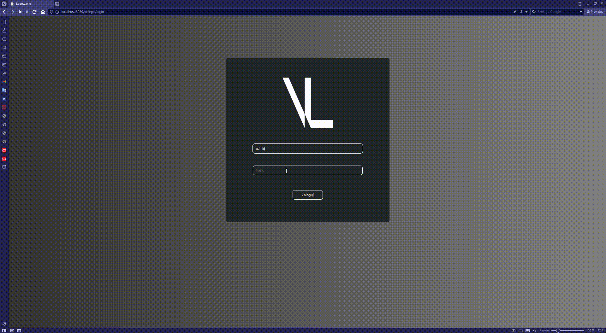
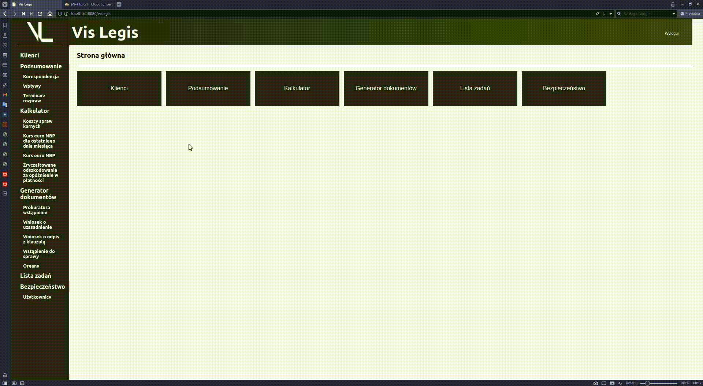
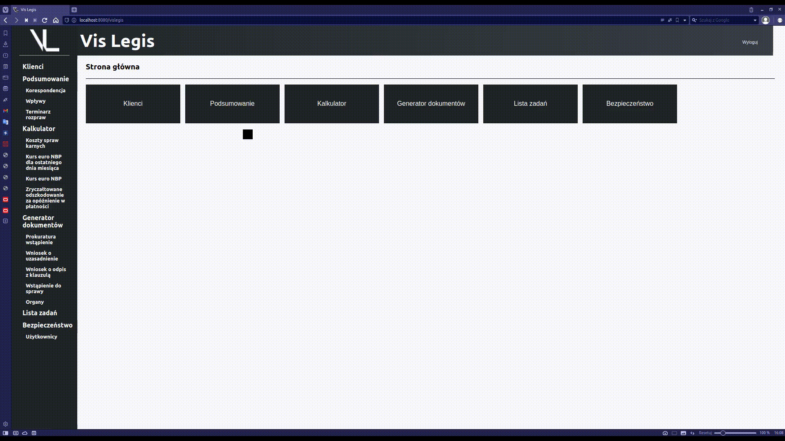
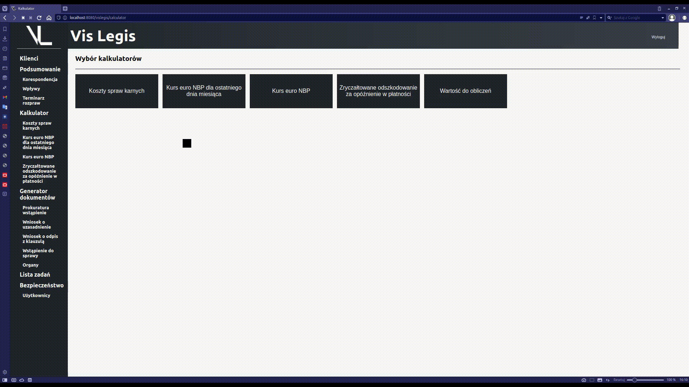
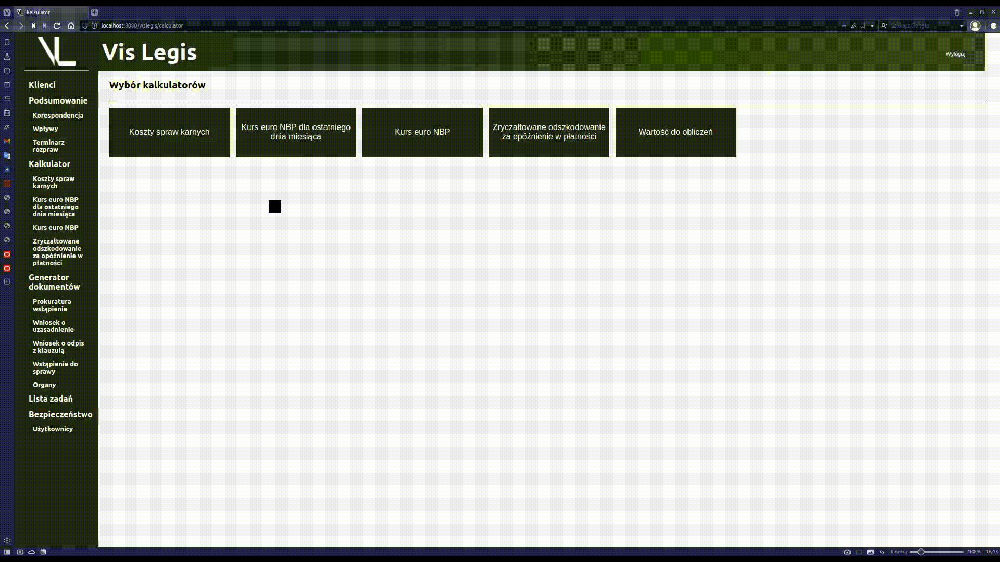
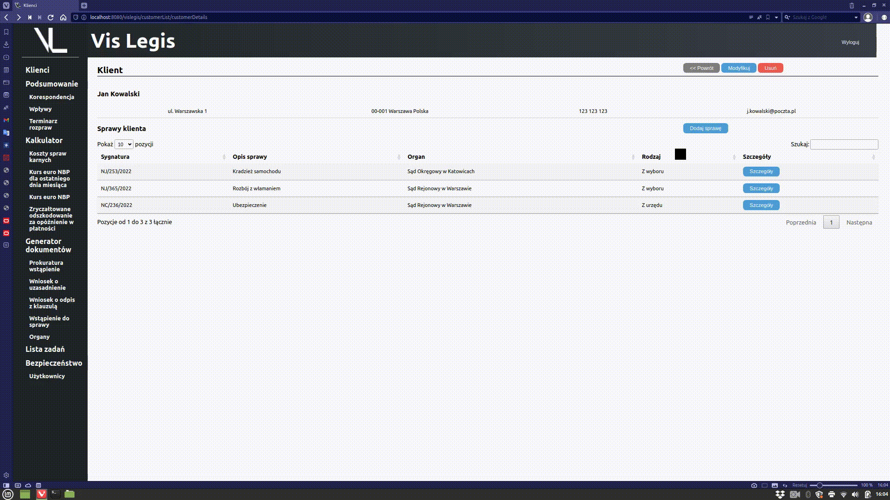
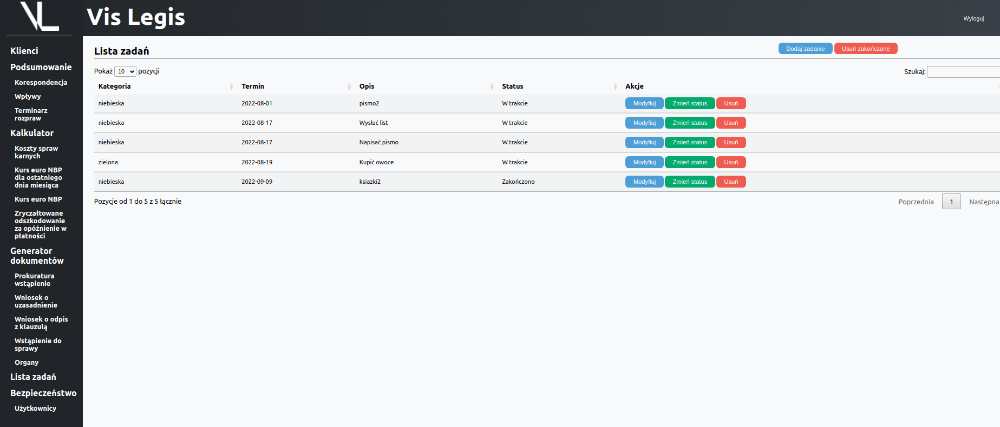

<p align="center">
  
</p>

# <center>**VisLegis**</center>

## Table of Contents
* [General Information](#general-information)
* [Technologies](#technologies)
* [Setup](#setup)
* [Database structure](#database-structure)
* [Features](#features)
* [Docker](#docker)
* [Project status](#project-status)
* [Room for improvement](#room-for-improvement)
* [Acknowledgements](#acknowledgements)
* [Contact](#contact)

## General Information
This is a web application created to help manage the small lawyer companies.
The basic function is to save customers, cases, incomes, correspondence etc. in database. At this level the program should be able to fully replace the Excel spreed sheets, so commonly used by small companies.
There are same additional functions as specialized lawyer's calculators to calculate the stakes (loading data form NBP api - Narodowy Bank Polski), documentation generator to generate filled documents from templates etc.

### Project description
Application is build using Spring Boot framework. It uses MVC (Model-view-controller) architectural pattern with Hibernate as ORM, Thymeleaf responsible for UI and Apache Tomcat as server. The program stores data using MySQL database.
The whole program and files structure is divided into sections according to the main application features.

### Project aim
The goal was to use in practice programming skills learned from courses and in the same time create application that may be used in practice. This two objectives were leading the way during the whole project development and indicating the features that may be useful and should be created.

## Technologies
In application the following technologies were used:
- Java 11
- Spring (Spring Boot 2.7.2)
- Maven 2.7.1
- Hibernate 5.6.9
- Thymeleaf 3.0.15
- HTML5
- CSS
- MySQL 8.0.28

Additionally in limited range:
- JavaScript
- jQuery.ajax()

## Setup
Project works with MySQL database. To run the application, first user has to build database structure. There is already prepared script "DataBaseSetup.sql" which create new MySQL user ("vislegis@localhost") with default password ("L905k[!!!!"). The same name and password is defined in "application.properties" file. Changing them would required to create new application executable jar file with changed properties file.
The script also contains defined user of role "admin" with encrypted password (bctypt with cost 10). This is required for logging into the application.

After configuration of data base, project is ready to be lunched.
First it is recommended to create executable jar file. To do this run the following shell command from project directory.

For Linux:
```bash
$ ./mvnw package
```

For Windows:
```sh
$ mvnw package
```

The executable jar file is created in the target sub directory so you need to move to this location. Default file name is "VisLegis-1.0.0.jar". To start the application run the following shell command from target directory:
```bash
$ java -jar VisLegis-1.0.0.jar
```

After execution of above statement the application should be running on default Spring Boot port 8080.

Next in browser URL type:
>http://localhost:8080/vislegis/login

At this stage, login page should be visible. To login use default username and password:
>login: admin

>password: L905k[@@@@


## Database structure
Project is using MySQL relational database. The core of the application is:
- 8 tables for customer manage system
- 2 tables for user and authorities system
- 2 separate tables: to-do List and with constant values used for calculations
- 4 views

<p align="center">
  
</p>
<p align="center">
<sub>Database structure</sub>
</p>

## Features
The application starts with login form where user has to sign in with username and password.
<p align="center">
  
</p>
<p align="center">
<sub>Logging form</sub>
</p>

After logging in user can see main page with the application main features.

### Customer ("Klienci")
In customer section user can see table with registered customers. After clicking customer details buttons he can see the list off all law cases that are assigned to the customer.
<p align="center">
  
</p>

<p align="center">
<sub>Customer feature</sub>
</p>


After going into specific case details user can see the incomes, correspondence, customer costs and court hearing agenda for specific law case. On every stage user can add, modify and delete each data. From this section he can also generate already filled documents with data from choosen case (more information in Document generator chapter).


### Summary ("Podsumowanie")
In this section user can see the summary of all incomes, court hearing agenda and correspondence from all clients.
<p align="center">
  
</p>
<p align="center">
<sub>Summary, incomes feature</sub>
</p>

### Calculators ("Kalkulator")
In this section user has four types of calculators:
- Koszty spraw karnych
- Kurs euro NBP dla ostaniego dnia miesiąca
- Kurs euro NBP
- Zryczałtowane odszkodownie za opóźnienia w płatności

In each calculator user has to fill short form and according to the responses, application generate the table with results.
<p align="center">
  
</p>
<p align="center">
<sub>Koszty spraw karnych calculator feature</sub>
</p>

Additionally three of mentioned calculators connect with NPB api (Narodowy Bank Polski) and download the historical euro exchange rate from the specific dates range and shows this data or use for further calculations.
<p align="center">
  
</p>
<p align="center">
<sub>Kurs euro NBP dla ostaniego dnia miesiąca calculator feature</sub>
</p>


### Documents generator ("Generator dokumentów")
This feature user can access form the position of chosen case or from main menu. Depending on the chosen option he receive short form, already filled or blank. According to the responses in the form he can generate already filled document in .docx format from templates.
<p align="center">
  
</p>
<p align="center">
<sub>Document generator feature</sub>
</p>

In the application there are four types of documents:
- Prokuratura wstąpienie
- Wniosek o uzasadnienie
- Wniosek o odpis z klauzulą
- Wstąpienie do sprawy


### To-Do List ("Lista zadań")
In this feature user has simple To-Do List where he can save, delete, modify and mark as done tasks.
<p align="center">
  
</p>
<p align="center">
<sub>To-Do List</sub>
</p>

### Security ("Bezpieczeństwo")
In this section user from the position of administrator can manage the roles for new users. In spring security java configuration class the access for each user is defined and cannot be changed. For each user's role the UI is customized and some features are not visible. Access by URL path is also defined and access denied window will show on for unauthorized user.

```java
@Bean
public SecurityFilterChain filterChain(HttpSecurity http) throws Exception {

	http
		.authorizeRequests((authz) -> authz
			.antMatchers("/vislegis/customerList/updateCustomerForm").hasAnyRole("ADMIN", "MANAGER")
			.antMatchers("/vislegis/customerList/customerDetails/deleteCustomer").hasAnyRole("ADMIN", "MANAGER")
			.antMatchers("/vislegis/customerList/customerDetails/updateLawCaseForm").hasAnyRole("ADMIN", "MANAGER")
			.antMatchers("/vislegis/customerList/customerDetails/caseDetails/deleteLawCase").hasAnyRole("ADMIN", "MANAGER")
			.antMatchers("/vislegis/customerList/customerDetails/caseDetails/updateIncomeForm").hasAnyRole("ADMIN", "MANAGER")
			.antMatchers("/vislegis/customerList/customerDetails/caseDetails/deleteIncome").hasAnyRole("ADMIN", "MANAGER")
			.antMatchers("/vislegis/customerList/customerDetails/caseDetails/updateCustomerCaseCostForm").hasAnyRole("ADMIN", "MANAGER")
			.antMatchers("/vislegis/customerList/customerDetails/caseDetails/deleteCustomerCaseCost").hasAnyRole("ADMIN", "MANAGER")
			.antMatchers("/vislegis/customerList/**").hasAnyRole("ADMIN", "MANAGER", "EMPLOYEE")
			.antMatchers("/vislegis/summary/letters/deleteLetter").hasAnyRole("ADMIN", "MANAGER")
			.antMatchers("/vislegis/summary/letters**").hasAnyRole("ADMIN", "MANAGER", "EMPLOYEE")
			.antMatchers("/vislegis/summary/incomes/**").hasAnyRole("ADMIN", "MANAGER")
			.antMatchers("/vislegis/summary/courtHearings/deleteHearing").hasAnyRole("ADMIN", "MANAGER")
			.antMatchers("/vislegis/summary/courtHearings**").hasAnyRole("ADMIN", "MANAGER", "EMPLOYEE")
			.antMatchers("/vislegis/summary/**").hasAnyRole("ADMIN", "MANAGER", "EMPLOYEE")
			.antMatchers("/vislegis/calculator/values/updateValueForm").hasRole("ADMIN")
			.antMatchers("/vislegis/calculator/**").hasAnyRole("ADMIN", "MANAGER", "EMPLOYEE")
			.antMatchers("/vislegis/docGenerator/courtsList/updateCourtForm").hasAnyRole("ADMIN", "MANAGER")
			.antMatchers("/vislegis/docGenerator/courtsList/deleteCourt").hasAnyRole("ADMIN", "MANAGER")
			.antMatchers("/vislegis/docGenerator/**").hasAnyRole("ADMIN", "MANAGER", "EMPLOYEE")
			.antMatchers("/vislegis/toDoList/**").hasAnyRole("ADMIN", "MANAGER")
			.antMatchers("/vislegis/security/**").hasRole("ADMIN")
			.antMatchers("/vislegis").hasAnyRole("ADMIN", "MANAGER", "EMPLOYEE")
		)
```

## Docker
To create docker MySql database and applicaton image you need to:
- go to application.properties file comment out "MySQL connection properties" section and uncomment "MySQL connection properties for Docker image",
- create jar file using maven ```mvn clean package```,
- change jar file name to 'vislegis' (Docker does not handle camelCase notation),
- go to ```VisLegis/docker``` and run ```sudo docker compose up``` (you need to have docker compose application),
- check if image and container are running: ```sudo docker images``` and ```sudo docker container ls -a```.

Docker will create new MySql database running in container on port 3307 (to avoid conflict if you already have some locale database running on port 3306) and application running on port 8080 (port can be changed in ```docker-compose.yml``` file). Default user and password (both) for data base is: ```root```.

## Project status
The main core of the application is finished. Is has all the functions that were established at the beginning of the project. The architecture of the application allows to add more features without major interference with the current ones.

Next phase is to check the project in use and according to received feedback establish next development steps.


## Room for improvement
The main development opportunities are:
- integration with google or Microsoft services (calendar, to-do List etc.),
- creating new user type - "customer" with access limited to his own data,
- transferring application into REST - major change

## Acknowledgements
Special thanks to DDS company for legal consultations and support during the whole development of this application.

## Contact
For more information contact with repository owner.
