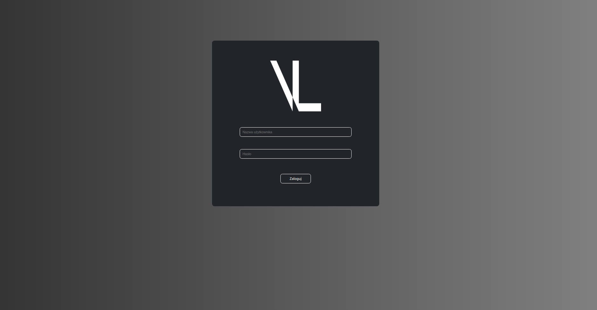
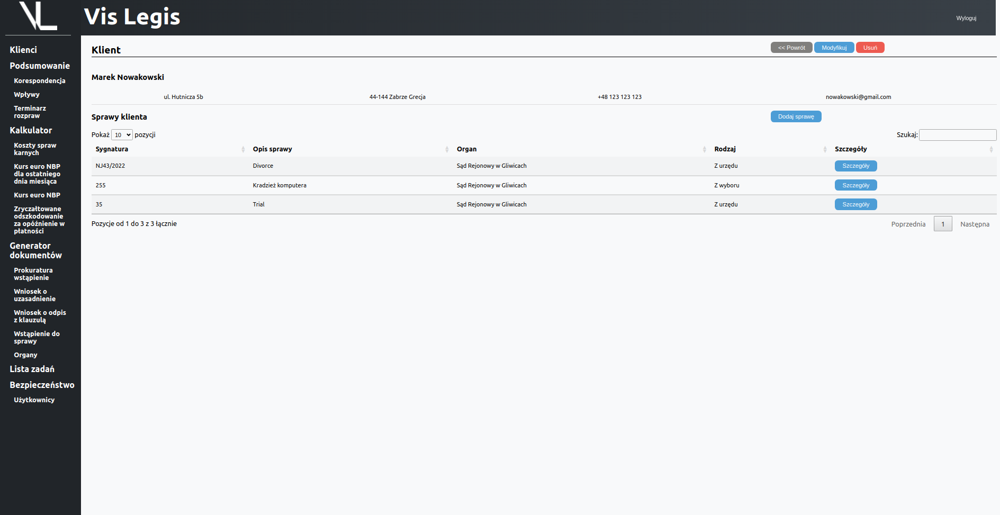
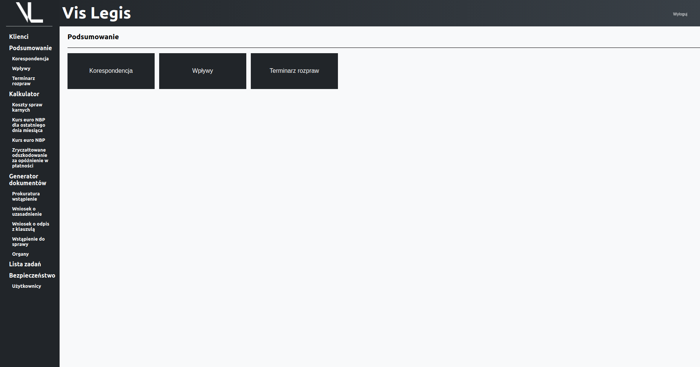
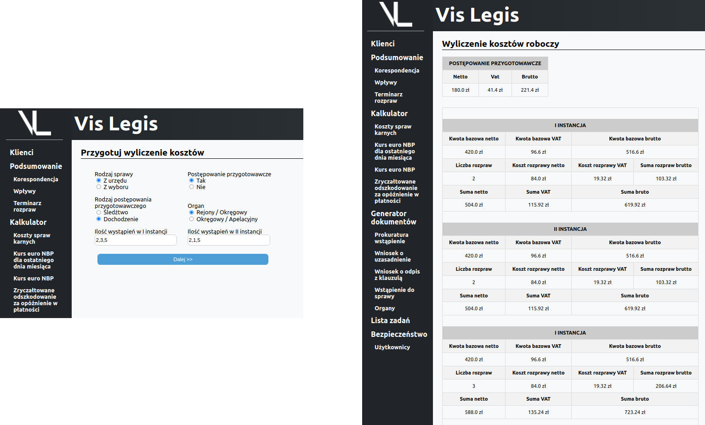
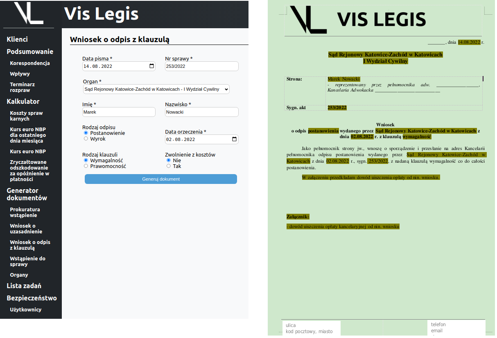
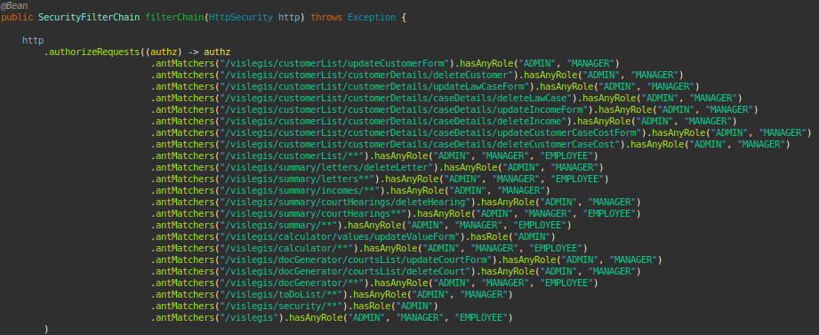

  

# 
VisLegis

## Introduction
This is a web application created to help manage the small lawyer companies.
The basic function is to save customers, cases, incomes, correspondence etc. in data base. At this level it should be able to fully replace the Excel spreed sheets, so commonly used by small companies.
There are same additional functions as specialized lawyer calculators to calculate the stakes (loading some data form NBP api - Narodowy Bank Polski), documentation generator that generate filled documents from templates etc.
### Project description
Application is build using Spring Boot framework. It uses MVC (Model-view-controller) architectural pattern with Hibernate as ORM, Thymeleaf responsible for UI and Apache Tomcat as server. The program stores data using MySQL data base.
The whole program and files architecture is divided into sections according to the main application features.
### Project aim
The goal was to use in practice programming skills learned from courses and in the same time create application that may be indeed used in companies. This two objectives were leading the way during the whole project development and indicating the features that may be useful and should be created.

### What problem solves

## Technologies
In application the following technologies were used:
- Java 11
- Spring (Spring Boot)
- Maven
- Hibernate
- Thymeleaf
- HTML5
- CSS
- MySQL
- Git

And additional without proper knowledge (based on internet ready templates):
- JavaScript
- jQuery.ajax()

## How to lunch the project (Setup)

## Data base structure

  

## Features (with screen shots)
The application starts with login form where user has to log in with user name and password.

  

After logging in user can see main page with the application main features.
### Customer ("Klienci")
In customer section user can see table with registered customers. When he click the customer details he has list off all law cases that are assigned to the customer.

  

After going into specific case details user can see the incomes, correspondence, customer costs and court hearing agenda for specific law case. On every stage user can add, modify and delete each data. From this section he can also generate already filled documents with data from chooses case (more information in Security chapter).

  

### Summary ("Podsumowanie")
In this section user can see the summary off all incomes, court hearing agenda and correspondence from all clients.

  

### Calculators ("Kalkulator")
In this section user has four types of calculators:
- Koszty spraw karnych
- Kurs euro NBP dla ostaniego dnia miesiąca
- Kurs euro NBP
- Zryczałtowane odszkodownie za opóźnienia w płatności

In each calculator user has to fill short form and according to the responses, application generate the table with results.

  

Additionally three of mentioned calculators connect with NPB api (Narodowy Bank Polski) and download the historical euro exchange rate from the specific dates range and use this data for calculations.  

### Documents generator ("Generator dokumentów")
In this section user may fill the short form and generate filled documents from templates in the form of .doxc.

  

In the application there are four types of documents:
- Prokuratura wstąpienie
- Wniosek o uzasadnienie
- Wniosek o odpis z klauzulą
- Wstąpienie do sprawy

In this section user has list of defined institutions used if forms to generate the documents.

### To-Do List ("Lista zadań")
In this feature user has simple To-Do List where he can save, delete, modify and mark as done tasks.

  

### Security ("Bezpieczeństwo")
Here user from the position of administrator can manage the roles for new users. In spring security java configuration class the access for each user is defined and cannot be changed. For each user's role the UI is customized and some features are not visible. Access by URL path is also defined and access denied window will show on for unauthorized user.

  

## Project status
The core of the application is finished. Is has all the functions that were established at the beginning of the project. The architecture of the application allows to add more features without interference with the current.
The main development opportunities are:
- integration with google or Microsoft services (calendar, toDoList etc.),
- creating the customer account with access limited to his own data,
- transferring application into REST technology - major change

## Room for improvement

## Acknowledgements

## Sources

## License
